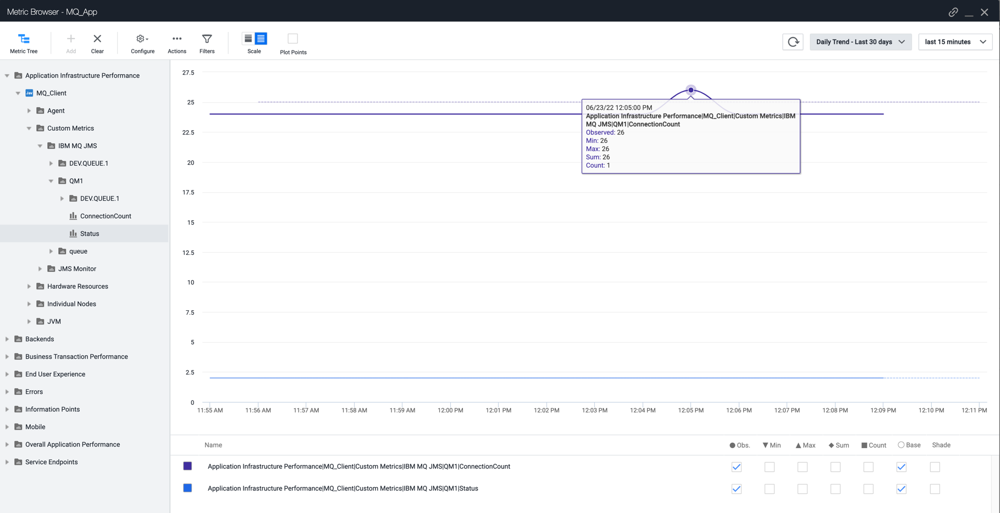
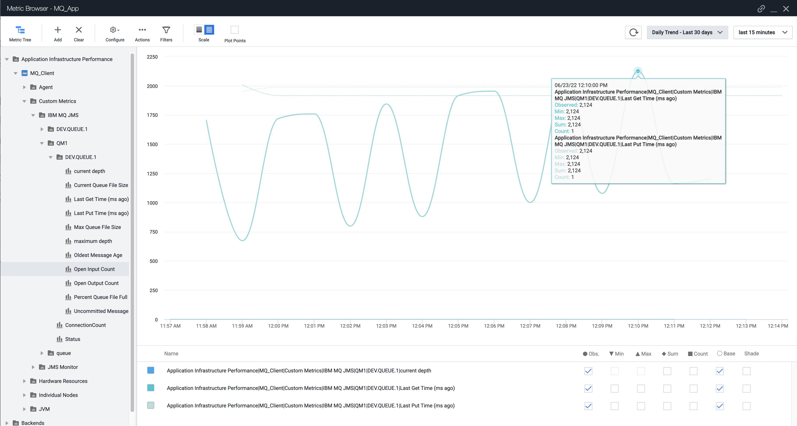

# AppDynamics MQ Agent Plugin

This plugin is intended to replace the Machine Agent Based Extension for MQ, and collect the data needed by interception rather than query

### Metrics Collected
Each node will collect the following metrics, that will then combine up to the Tier level of the Application they are running as a part of. Custom dashboards and alerts can be configured for them just as other metrics. 

Root Metric Path: "Application Infrastructure Performance|<Tier>|Custom Metrics|IBM MQ JMS"

Queue Manager:
- <Queue Manager Name\>|Status = The numeric status of the queue manager as defined by IBM 
- <Queue Manager Name\>|ConnectionCount = The number of active connections currently open

Queue:
- <Queue Manager Name\>|<Queue\>|Current Depth
- <Queue Manager Name\>|<Queue\>|Max Depth
- <Queue Manager Name\>|<Queue\>|Current Queue File Size
- <Queue Manager Name\>|<Queue\>|Max Queue File Size
- <Queue Manager Name\>|<Queue\>|Percent Queue File Full = Current Queue File Size / Max Queue File Size
- <Queue Manager Name\>|<Queue\>|Open Input Count
- <Queue Manager Name\>|<Queue\>|Open Output Count
- <Queue Manager Name\>|<Queue\>|Last Get Time (ms ago)
- <Queue Manager Name\>|<Queue\>|Last Put Time (ms ago)
- <Queue Manager Name\>|<Queue\>|Oldest Message Age
- <Queue Manager Name\>|<Queue\>|Uncommitted Message Count

Channel:
- <Queue Manager Name\>|Channel|<Channel Name\>|Bytes Sent
- <Queue Manager Name\>|Channel|<Channel Name\>|Bytes Received
- <Queue Manager Name\>|Channel|<Channel Name\>|Buffers Sent
- <Queue Manager Name\>|Channel|<Channel Name\>|Buffers Received
- <Queue Manager Name\>|Channel|<Channel Name\>|Status

Topics:
- <Queue Manager Name\>|Topic|<Topic Name\>/<Topic String\>|Publish Count
- <Queue Manager Name\>|Topic|<Topic Name\>/<Topic String\>|Subscription Count

Please create an issue to request either more metrics, or any custom events triggered by specific conditions, should they be available for query from the Queue Manager.

## Requirements
- MQ Version 9.2.5.0+ (This is the client lib version in use, it may support many versions, we will have to see)
- Agent version 22.1+
- Java 8+

## Deployment steps
- Copy AgentPlugin jar file under <agent-install-dir>/ver.x.x.x.x/sdk-plugins

## Configuration options

If the users the application is authenticating with the MQ Queue manager are not authorized to monitor the queue, we will need to configure authentication information for the queue manager that is authorized. This is in an optional JSON file in the sdk-plugins directory named "IBMMQAgentPlugin-authentications.json"
Here is an example of such a file:

    [
        { "default": true, "userID": "mqm", "password": "", "channel": "MONITOR.SRVCONN" },
        { "hostname": "someHost", "port": 1414, "userID": "mqm", "password": "", "channel": "MONITOR.SRVCONN" },
        { "hostname": "someOtherHost", "port": 1414, "userID": "someOtherUser", "password": "someOtherPassword", "channel": "MONITOR.SRVCONN" }
    ]

### Sleep interval between collection runs

To modify the sleep between monitoring runs to pull data from the Queue Managers from 30,000ms (30 seconds) to something higher, the minimum is enforced to 30 seconds. set the following JVM property:

    -DIBMMQAgentPlugin.sleepTimeMS=##

